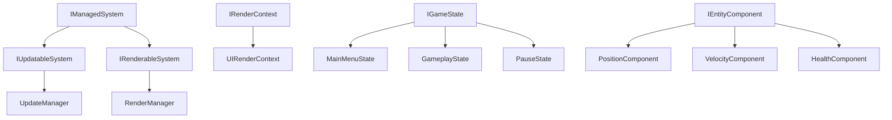
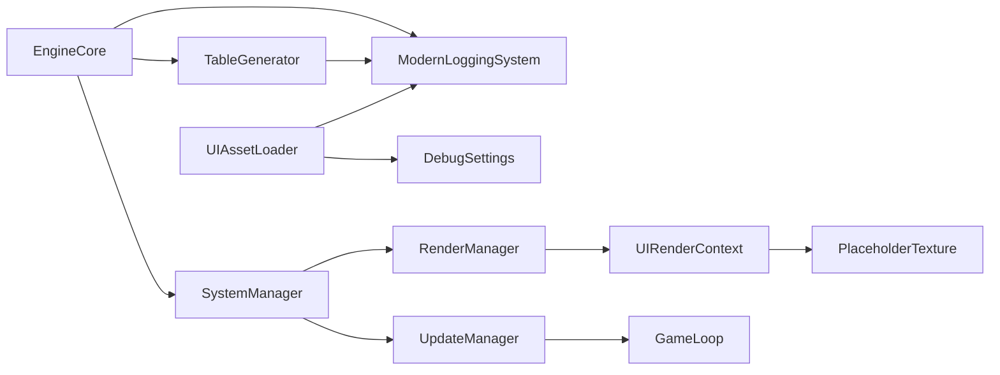

# SAS Zombie Assault TD - README Appendixes

---

## Appendix A: Project Directory Structure

```
SASZombieAssaultTD/
├── Engine/
│   ├── AI/                    # Enemy behavior trees & chase logic
│   ├── Achievements/          # Achievement system & UI renderers
│   ├── Animation/             # Animation tracks, transitions, blend trees
│   │   ├── BlendTree/
│   │   ├── Components/
│   │   ├── Core/              # AnimationTransition, AnimationTrack
│   │   ├── Events/
│   │   └── Integration/
│   ├── Assets/                # PlaceholderTexture, asset utilities
│   ├── Audio/                 # Sound effects & music pipeline
│   ├── Camera/                # Camera control & viewport management
│   ├── Challenges/            # Challenge definitions & validation
│   ├── Components/            # ECS components (Position, Velocity, etc.)
│   ├── Core/                  # EngineCore, logging systems
│   ├── Data/                  # TableGenerator, JSON data utilities
│   ├── Debug/                 # DebugSettings flags
│   ├── Diagnostics/           # Performance profiling, health checks
│   ├── ECS/                   # Entity Component System
│   │   ├── Components/
│   │   └── Systems/
│   ├── Enemies/               # Enemy types, spawning, AI controllers
│   ├── GameLoop/              # Main game loop implementation
│   ├── GameRoot/              # GameRoot initialization & state
│   ├── Gameplay/              # Core gameplay systems
│   ├── Input/                 # Input handling & UI router
│   ├── Interfaces/            # Core interfaces (IManagedSystem, etc.)
│   ├── Navigation/            # Pathfinding, NavAgent, migration helpers
│   ├── Physics/               # Collision detection, physics shapes
│   ├── Rendering/             # Texture2D, SpriteBatch, render context
│   ├── Resources/             # Asset loading, RSManager, bundles
│   ├── Scenes/                # Game scenes (MainMenu, Pause, etc.)
│   ├── State/                 # State machines & transitions
│   ├── Systems/               # SystemManager, UpdateManager, RenderManager
│   ├── Towers/                # Tower definitions, placement, upgrades
│   ├── UI/                    # UI rendering, HUD, menus
│   │   ├── HUD/               # Lives display, wave counter, etc.
│   │   ├── Menus/             # Main menu, pause menu
│   │   └── Rendering/         # UIRenderContext
│   ├── VectorMath/            # Vector3, Vector3Int, Matrix4x4
│   ├── Waves/                 # Wave spawning, director, patterns
│   └── Window/                # Window management
├── Content/                   # Game assets (textures, sounds)
└── EXECUTION_TREE_MAP.md      # Engine execution flow documentation
```

---

## Appendix B: Core Interface Hierarchy



---

## Appendix C: Debug Settings Reference

| Flag | Type | Default | Description |
|------|------|---------|-------------|
| `GenerateTables` | `bool` | `true` | When true, generates JSON tables during engine initialization |
| `SkipImageLoading` | `bool` | `true` | When true, returns placeholder textures instead of loading actual images |

### Usage Example
```csharp
using SASZombieAssaultTD.Engine.Debug;

// Check if table generation is enabled
if (DebugSettings.GenerateTables)
{
    TableGenerator.BuildAll();
}

// Skip image loading in debug mode
if (DebugSettings.SkipImageLoading)
{
    return PlaceholderTexture.Instance;
}
```

---

## Appendix D: Key Engine Systems

| System | File | Purpose |
|--------|------|---------|
| EngineCore | `Engine/Animation/Core/EngineCore.cs` | Bootstrap & lifecycle management |
| SystemManager | `Engine/Systems/SystemManager.cs` | System registration & retrieval |
| UpdateManager | `Engine/Systems/UpdateManager.cs` | Per-frame update scheduling |
| RenderManager | `Engine/Systems/RenderManager.cs` | Rendering coordination |
| UIRenderContext | `Engine/UI/Rendering/UIRenderContext.cs` | UI-specific rendering |
| TableGenerator | `Engine/Data/TableGenerator.cs` | JSON table generation |
| PlaceholderTexture | `Engine/Assets/PlaceholderTexture.cs` | Debug placeholder asset |
| DebugSettings | `Engine/Debug/DebugSettings.cs` | Debug configuration flags |

---

## Appendix E: Vector3-Only Architecture Rule

**CRITICAL: NEVER use Vector2 in the engine.**

| Type | Status | Purpose |
|------|--------|---------|
| `Vector3` | ✅ Required | All 2D/3D positions (Z=0 for 2D) |
| `Vector3Int` | ✅ Required | Integer grid coordinates |
| `Vector4` | ✅ Required | Colors, quaternions |
| `Matrix4x4` | ✅ Required | 3D transformations |
| `Vector2` | ❌ **NEVER** | Not allowed in engine code |

### Exception
- `System.Numerics.Vector2` is OK in existing code (`Rect.cs`, `GraphicsTypes.cs`)
- `SASZombieAssaultTD.Engine.VectorMath.Vector2` is **NEVER** allowed

---

## Appendix F: System Dependencies



---

## Appendix G: File Naming Conventions

| Pattern | Example | Purpose |
|---------|---------|---------|
| `*Main.cs` | `GameLoopMain.cs`, `HazardsMain.cs` | Entry points for systems |
| `I*.cs` | `IRenderContext.cs`, `IGameState.cs` | Interface definitions |
| `*Manager.cs` | `SystemManager.cs` | Manager classes |
| `*Renderer.cs` | `AchievementPopupRenderer.cs` | Rendering classes |
| `*_UI.cs` | `AchievementListRenderer_UI.cs` | UI-specific variants |

---

*Generated for SAS Zombie Assault TD Engine Documentation*
