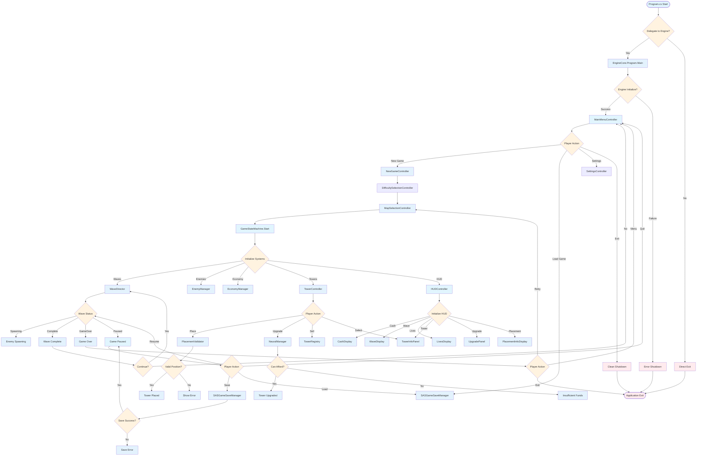
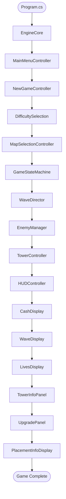

flowchart TD
    Start([Program.cs Start]) --> EngineCore[EngineCore.Program.Main]
    EngineCore --> MainMenu[MainMenuController]
    
    MainMenu --> NewGame[NewGameController]
    MainMenu --> LoadGame[SASGameSaveManager]
    MainMenu --> Settings[SettingsController]
    
    NewGame --> Difficulty[DifficultySelectionController]
    LoadGame --> MainMenu
    Settings --> MainMenu
    
    Difficulty --> MapSelection[MapSelectionController]
    MapSelection --> GameStart[GameStateMachine.Start]
    
    GameStart --> WaveDirector[WaveDirector]
    GameStart --> EnemyManager[EnemyManager]
    GameStart --> EconomyManager[EconomyManager]
    GameStart --> TowerController[TowerController]
    GameStart --> HUDController[HUDController]
    
    HUDController --> CashDisplay[CashDisplay]
    HUDController --> WaveDisplay[WaveDisplay]
    HUDController --> LivesDisplay[LivesDisplay]
    HUDController --> TowerInfoPanel[TowerInfoPanel]
    HUDController --> UpgradePanel[UpgradePanel]
    HUDController --> PlacementInfo[PlacementInfoDisplay]
    
    TowerController --> PlacementValidator[PlacementValidator]
    TowerController --> NeuralManager[NeuralManager]
    TowerController --> TowerRegistry[TowerRegistry]
    
    PlacementValidator --> TowerPlaced[Tower Placed]
    NeuralManager --> TowerUpgraded[Tower Upgraded]
    TowerRegistry --> TowerSold[Tower Sold]
    
    WaveDirector --> EnemySpawn[Enemy Spawning]
    WaveDirector --> WaveComplete[Wave Complete]
    
    EnemySpawn --> TowerController
    WaveComplete --> NextWave[Next Wave]
    
    TowerPlaced --> HUDController
    TowerUpgraded --> HUDController
    TowerSold --> HUDController
    NextWave --> WaveDirector
    
    classDef gameState fill:#e1f5fe
    classDef process fill:#e3f2fd
    classDef endState fill:#ffebee
    
    class Start,MainMenu,GameStart,HUDController gameState
    class EngineCore,NewGame,LoadGame,Settings,Diculty,MapSelection,WaveDirector,EnemyManager,EconomyManager,TowerController,CashDisplay,WaveDisplay,LivesDisplay,TowerInfoPanel,UpgradePanel,PlacementInfo,PlacementValidator,NeuralManager,TowerRegistry,TowerPlaced,TowerUpgraded,TowerSold,EnemySpawn,WaveComplete,NextWave process
```

## Alternative Decision Flow Version



## Simple Vertical Stack Version



## Usage Instructions

### How to Use These Flowcharts

1. **Copy the entire code block** including the ```mermaid tags
2. **Paste into your Mermaid tool** (like mermaid.live, draw.io, etc.)
3. **Choose which version** you want:
   - Simple vertical stack for clean flow
   - Decision flow for detailed logic
   - Complete version for full architecture

### Customization Tips

- **Change colors**: Modify the `classDef` values
- **Add nodes**: Follow the `NodeName[Label]` pattern
- **Create decisions**: Use `DecisionName{Question}` syntax
- **Add labels**: Use `-->|Label|` for branch labels
- **Group nodes**: Use `class` statements to style groups

### Folder Structure Mapping

Each node represents:
- **C# Class**: The actual class name
- **Folder Location**: Based on engine structure
- **Process Flow**: How execution moves between systems
- **Decision Points**: Where logic branches occur

This file provides ready-to-use Mermaid code for SAS TD flowchart creation.
